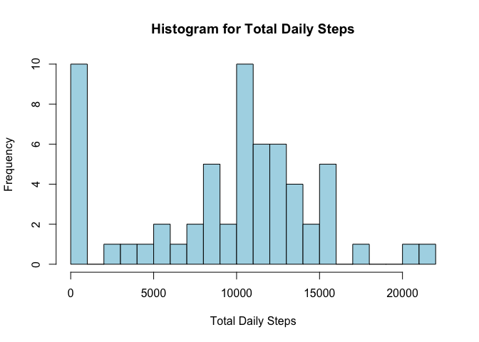
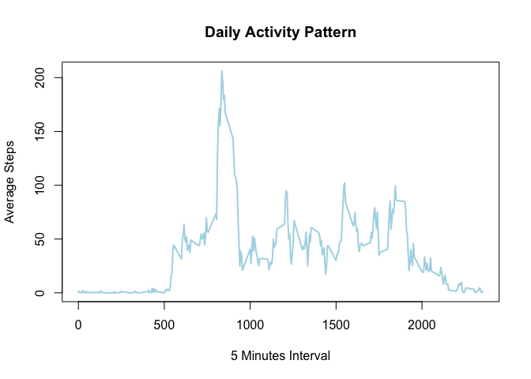
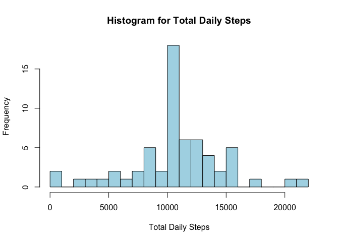
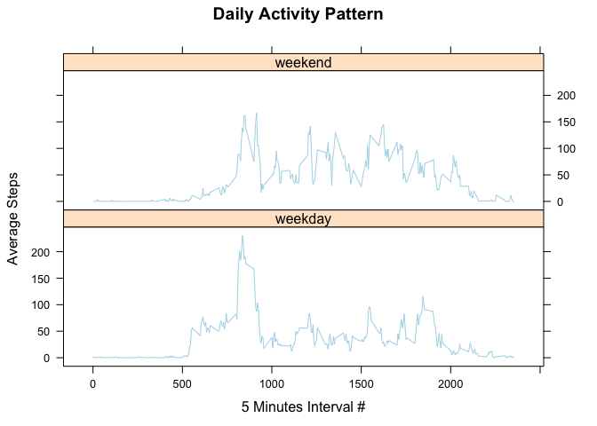

# Reproducible Research: Peer Assessment 1
 by Ihor Shkurko

## Loading and preprocessing the data

1. Load the data through `read.csv()` and `unz()` for unzipping.

```r
data <- read.csv(unz("activity.zip", "activity.csv"))
```

2. Ttransform dates string into a date through `lubridate` library and function `ymd()`

```r
library(lubridate)
data$date <- ymd(data$date)
```

## What is mean total number of steps taken per day?

1. Calculate the total number of steps taken per day trhough `dplyr` functions

```r
require(dplyr)
steps <- data %>%
    select(date, steps) %>%
    group_by(date) %>%
    summarise(mdsteps = mean(steps, na.rm = TRUE),
              tdsteps = sum(steps, na.rm = TRUE))
```

2. Create histogram of the total number of steps taken each day to visualize it

```r
hist(steps$tdsteps, breaks = 20, col = "lightblue", main = "Histogram for Total Daily Steps", 
    xlab = "Total Daily Steps")
```

 

3. Calculate the mean and median of the total number of steps taken per day through functions `mean()` and `median()`

```r
mean(steps$tdsteps, na.rm = TRUE)
```

```
## [1] 9354.23
```


```r
median(steps$tdsteps, na.rm = TRUE)
```

```
## [1] 10395
```

## What is the average daily activity pattern?

1. Series plot of the 5-minute interval (x-axis) and the average number of steps taken, averaged across all days (y-axis)

```r
require(dplyr)
steps <- data %>%
    select(interval, steps) %>%
    group_by(interval) %>%
    summarise(misteps = mean(steps, na.rm = TRUE))
```


```r
plot(steps$interval, steps$misteps, type = "l", col = "lightblue", lwd = 2, 
    xlab = "5 Minutes Interval", ylab = "Average Steps", main = "Daily Activity Pattern")
```

 

2. 5-minute interval, on average across all the days in the dataset, contains the maximum number of steps

```r
steps[steps$misteps == max(steps$misteps), ]
```

```
## Source: local data frame [1 x 2]
## 
##   interval  misteps
## 1      835 206.1698
```

## Imputing missing values

The presence of missing days may introduce bias into some calculations or summaries of the data. So we trying to fix this.

1. Calculate the total number of missing values in the dataset (i.e. the total number of rows with NAs)

```r
sum(is.na(data$steps))
```

```
## [1] 2304
```

2. We use the mean for that 5-minute interval, where we have NA steps.
3. Create a new dataset `cdata` that is equal to the original dataset but with the missing data filled in

```r
cdata <- merge(data, steps, by = "interval")
cdata[is.na(cdata$steps), 2] <- cdata[is.na(cdata$steps), 4]
cdata <- cdata[order(as.Date(cdata$date, format = "%Y-%m-%d"), cdata$interval), c(2,3,1)]
```

4. Histogram of the total number of steps taken each day

```r
require(dplyr)
steps <- cdata %>%
    select(date, steps) %>%
    group_by(date) %>%
    summarise(mdsteps = mean(steps, na.rm = TRUE),
              tdsteps = sum(steps, na.rm = TRUE))
```


```r
hist(steps$tdsteps, breaks = 20, col = "lightblue", main = "Histogram for Total Daily Steps", 
    xlab = "Total Daily Steps")
```

 

Calculate the mean and median total number of steps taken per day. That differ from the estimates from the first part of the assignment.

```r
mean(steps$tdsteps, na.rm = TRUE)
```

```
## [1] 10766.19
```


```r
median(steps$tdsteps, na.rm = TRUE)
```

```
## [1] 10766.19
```

Missing values have small impact.

## Are there differences in activity patterns between weekdays and weekends?

We are using the dataset with the filled-in missing values for this part.

1. Create a new factor variable in the dataset with two levels – “weekday” and “weekend” indicating whether a given date is a weekday or weekend day.

```r
cdata$weekday <- ifelse(weekdays(cdata$date) %in% c('Saturday','Sunday'), 'weekend', 'weekday')
```

2. Make a data and panel plot containing a time series plot (i.e. type = "l")of the 5-minute interval (x-axis) and the average number of steps taken, averaged across all weekday days or weekend days (y-axis).

```r
require(dplyr)
result <- cdata %>%
    select(weekday, interval, steps) %>%
    group_by(weekday, interval) %>%
    summarise(misteps = mean(steps, na.rm = TRUE))

library(lattice)
xyplot(misteps ~ interval | weekday, data = result, type = "l", col = "lightblue",
    layout = c(1, 2), xlab = "5 Minutes Interval #", ylab = "Average Steps", 
    main = "Daily Activity Pattern")
```

 

Patterns are different.
